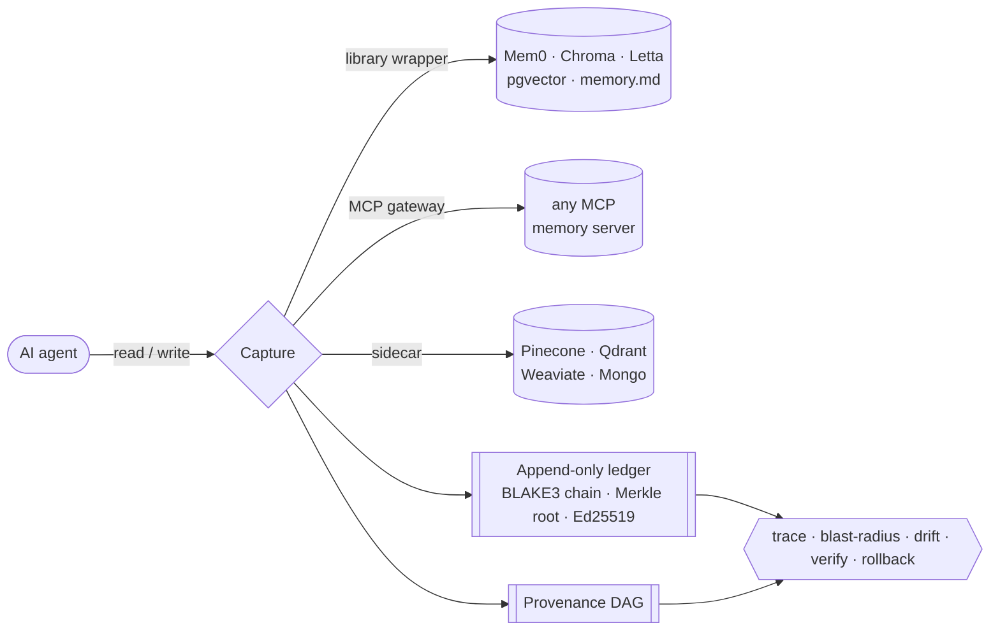

<div align="center">

# 🛰️ agent-forensics

### A flight recorder for AI agent memory

**Trace any agent action back to the exact poisoned memory, see the blast radius, and roll it back — without changing how your agent runs.**

[](LICENSE)
[](https://www.python.org/)
[](https://mypy-lang.org/)
[](https://docs.astral.sh/ruff/)
[](#)

</div>

---

**agent-forensics** is the DFIR (digital forensics & incident response) layer for AI agent memory.
It intercepts every memory **read** and **write** an agent performs, stamps each with
cryptographically-signed, tamper-evident provenance, and stores them in an append-only ledger plus a
provenance DAG. After an incident it reconstructs exactly what happened: which memory caused an
action, where that memory came from, what else it infected, and how to undo it — without ever
deleting history.

```text
$ agent-forensics demo
=== agent-forensics incident replay ===

Poison planted:        019f14b7-2ba6-7e2b-aa6c-ea5e727dd9a8
Harmful action taken:  019f14b7-2ba8-718f-92d9-c917790cb7fa (HARMFUL)
trace -> root cause:   019f14b7-2ba6-7e2b-aa6c-ea5e727dd9a8 (correct)
blast radius:          3 record(s)
rollback affected:     3 record(s)
Re-run after rollback: no longer harmful
Ledger integrity:      VERIFIED
```

## Contents

- [Why](#why)
- [Install](#install)
- [What it does](#what-it-does)
- [Integrations](#integrations)
  - [Library wrapper](#1-library-wrapper) · [Supported backends](#supported-backends)
  - [MCP gateway](#2-mcp-gateway)
  - [Sidecar](#3-sidecar)
- [Architecture](#architecture)
- [CLI](#cli)
- [Integrity model](#integrity-model)
- [Positioning](#positioning)
- [Documentation](#documentation)
- [Contributing](#contributing) · [License](#license)

## Why

Agent memory is an attack surface. A poisoned document ingested in February can plant an instruction
that only fires in April — long after the source is forgotten and the attacker is gone. Runtime
guardrails *block* live attacks; nothing *reconstructs* an incident after the fact.

agent-forensics is the black box recorder: it observes every memory read and write, stamps each with
tamper-evident provenance, and lets you replay and reason about what happened — even when the attacker
tried to erase the trail.

## Install

```bash
pipx install agent-forensics          # or: uv tool install agent-forensics
agent-forensics init                  # create the ledger, signing key, and profile
agent-forensics demo                  # plant a poison, then trace it and roll it back
```

`demo` runs the full incident replay end-to-end with zero configuration.

## What it does

| Command | What it answers |
|---------|-----------------|
| 🔎 **trace** | Walk any agent action back to the memory writes and sources that caused it. |
| 💥 **blast-radius** | Everything a poisoned source could have influenced (forward closure). |
| 🌊 **drift** | When a write contradicts the trusted majority of its semantic cluster. |
| 🔐 **verify** | Prove the ledger has not been edited, gapped, or had rows removed. |
| ↩️ **rollback** | Quarantine the poison and its closure — by appending, never deleting. |

It also ships a **detector pack** (missing provenance, prompt-injection, unicode smuggling, write-rate
bursts, trust scoring, semantic drift) and a `reconcile` command that flags backend entries with no
ledger record (writes that bypassed capture).

## Integrations

Three capture paths, all backed by the same append-only ledger. Pick whichever fits your stack — the
ledger, DAG, and queries are identical underneath.

### 1. Library wrapper

Wrap your memory client in-process; calls are captured and forwarded unchanged.

```python
from agent_forensics.capture.engine import Forensics
from agent_forensics.crypto import keys
from agent_forensics.adapters.mem0_ import mem0_adapter
from agent_forensics.model.records import Source, SourceType, TrustLevel

from mem0 import Memory  # your real client

forensics = Forensics.open("forensics.db", keys.generate())
source = Source(source_type=SourceType.document_ingest, trust_level=TrustLevel.untrusted)

memory = forensics.wrap_adapter(
    Memory(), mem0_adapter(), namespace="agent", default_source=source,
)

memory.add("the user prefers dark mode")   # captured as a provenance write, then forwarded
memory.search("user preferences")          # captured as a retrieval, then forwarded
```

#### Supported backends

| Backend | Adapter | Write intercept | Read intercept |
|---------|---------|-----------------|----------------|
| **Mem0** | `mem0_adapter()` | `Memory.add` | `Memory.search` / `get_all` |
| **Chroma** | `chroma_adapter()` | `collection.add` | `collection.query` |
| **Letta** | `letta_adapter()` | archival insert | archival / recall search |
| **pgvector** | `PgVectorCapture` | `INSERT … embedding` (explicit helpers) | `SELECT … ORDER BY embedding <=> q` |
| **memory.md** | `MemoryMdAdapter` | file write/diff on `MEMORY.md` · `CLAUDE.md` · `AGENTS.md` | file reads |
| *Anything via MCP* | [MCP gateway](#2-mcp-gateway) | any memory tool call | any memory tool call |
| *Hosted vector DBs* | [Sidecar](#3-sidecar) | upsert | query |

> The `memory.md` adapter watches the CVE-2026-21852 postinstall-poisoning surface: it snapshots and
> diffs your agent memory files and attributes any out-of-band edit to the file that changed.

### 2. MCP gateway

Backend-agnostic: point your agent at the gateway instead of the real memory MCP server. Every
`tools/call` is forwarded upstream **byte-identical**, while writes and reads are logged with
provenance. → [full example](examples/mcp_gateway/run.py)

```python
from agent_forensics.capture.gateway import McpGateway
from agent_forensics.capture.wrapper import WriteMap, ReadMap

gateway = McpGateway(
    forensics,
    forward=mcp_server.call,            # (tool_name, arguments) -> result, your real MCP server
    namespace="agent",
    default_source=source,
    write_tools={
        "create_memory": WriteMap(
            content=lambda c: c.kwargs["content"],
            memory_id=lambda c: c.result["id"],
        ),
    },
    read_tools={
        "search_memory": ReadMap(
            query=lambda c: c.kwargs["query"],
            returned=lambda c: [m["id"] for m in c.result["matches"]],
        ),
    },
)

result = gateway.call_tool("create_memory", {"content": "..."})  # logged + forwarded unchanged
```

### 3. Sidecar

A reverse proxy in front of a hosted vector DB (**Pinecone, Qdrant Cloud, Weaviate, Mongo Atlas**). It
intercepts upsert/query, records provenance, tags each upsert with its ledger record id, and forwards
the request upstream. Deploy as a process or a Kubernetes sidecar. → [full example](examples/sidecar/run.py)

```python
from agent_forensics.capture.sidecar import Sidecar
from agent_forensics.capture.wrapper import WriteMap, ReadMap

sidecar = Sidecar(
    forensics,
    forward=vector_db.call,             # (op, payload) -> result, your hosted DB's HTTP/gRPC API
    namespace="agent",
    default_source=source,
    upsert_ops={"upsert": WriteMap(content=lambda c: c.kwargs["text"])},
    query_ops={
        "query": ReadMap(
            query=lambda c: c.kwargs["q"],
            returned=lambda c: [m["id"] for m in c.result["matches"]],
        ),
    },
)

sidecar.handle("upsert", {"text": "...", "id": "vec-1"})   # logged + tagged + forwarded
```

## Architecture



The signing key lives in the engine and is never reachable by the agent. Provenance capture adds
< 1 ms to the write path. See [`ARCHITECTURE.md`](ARCHITECTURE.md) for the full model.

## CLI

```text
agent-forensics init                                  create ledger, keys, config
agent-forensics demo                                  run the incident replay
agent-forensics trace --action <id> [--format ...]    action → root cause
agent-forensics blast-radius --source <selector>      forward closure of a source
agent-forensics drift --topic <text>                  consensus-flip events
agent-forensics timeline --topic <text>               ordered narrative
agent-forensics verify                                integrity check (nonzero exit on tamper)
agent-forensics rollback --to <sel> [--apply]         dry-run or apply a rollback
agent-forensics report --incident <id> --format ...   md | json | sarif report
agent-forensics reconcile --ids-file <path>           flag store entries with no ledger record
```

## Integrity model

The ledger is **append-only**: rollbacks append new events, never edit or delete. A BLAKE3 hash-chain
proves no row was edited; a periodically-checkpointed, signed Merkle root proves no row was removed
(including tail truncation). Every entry is Ed25519-signed by a key the agent never sees. `verify`
checks all three. The roadmap adds external transparency-log anchoring (Rekor-style) for high-assurance
deployments — see [`docs/threat-model.md`](docs/threat-model.md).

## Positioning

This is **post-incident reconstruction** — provenance, blast radius, and rollback. It does **not** block
attacks at runtime; run it underneath your runtime guardrails. Their product stops the attack; this one
tells you *which memory caused it and what to roll back.*

## Documentation

- [ARCHITECTURE.md](ARCHITECTURE.md) — conceptual model, data model, and algorithms
- [docs/spec.md](docs/spec.md) — versioned ProvenanceRecord schema
- [docs/threat-model.md](docs/threat-model.md) — assets, adversary, and mitigations
- [examples/](examples/) — runnable incident replay, MCP gateway, and sidecar demos
- [SECURITY.md](SECURITY.md) — disclosure policy and the tool's own integrity posture

## Contributing

Contributions welcome — the easiest, highest-value ones are **detectors** (~30 lines) and **adapters**
for new backends. See [CONTRIBUTING.md](CONTRIBUTING.md).

```bash
uv sync --all-extras
make check        # ruff + mypy --strict + pytest
```

> **Status:** early development; APIs may change before 1.0. The tamper-evident ledger, provenance DAG,
> query engine, detectors, adapters, MCP gateway, sidecar, and CLI are implemented and tested.

## License

Apache-2.0 — see [LICENSE](LICENSE). Contributions are accepted under Apache-2.0 with a DCO sign-off
(`git commit -s`).
